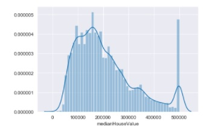
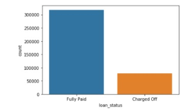
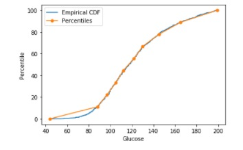
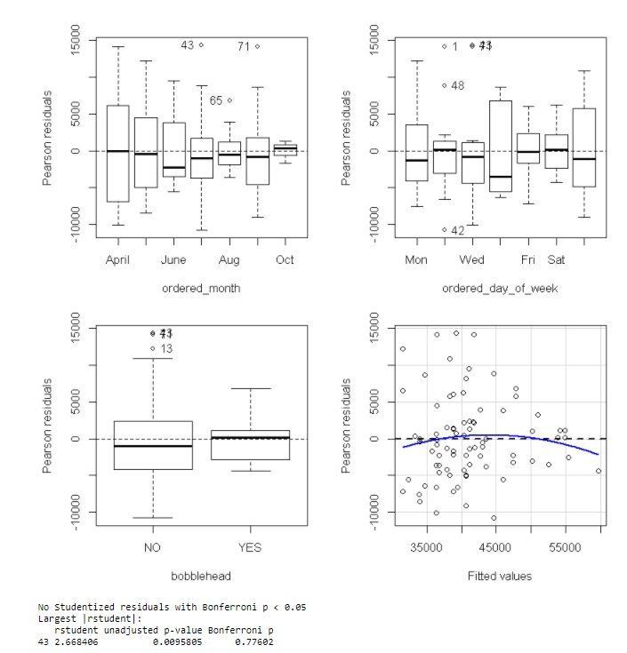
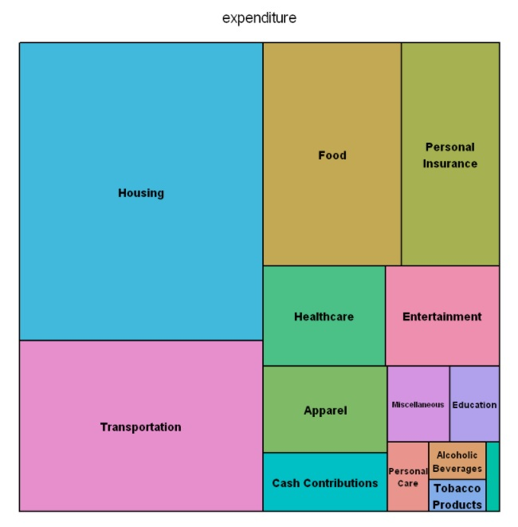

# Hanh_Portfolio
Data Science Projects Portfolio

# [Project 1: Movie Recommender System: Project Overview](https://github.com/htran017/Hanh_Portfolio/blob/2cf3720d24330c186cc77c1b1dfb9a505aab64de/TranHanh_DSC680_Project1_MovieRecommender.ipynb)
- Created a tool to recommend movies based on content-based methods. Content based is focused on the attributes of items and give a recommendation based on the similarity between them.
- Spark.ml – supports model-based collaborative filtering 
- ALS – Matrix Factorization approach to implement a recommendation algorithm to decompose item/user matrix into lower dimensional user factors and item factors

# [Project 2: Linear Regression Model using Tensorflow: House Price Prediction Overview](https://github.com/htran017/Hanh_Portfolio/blob/ddf650f92c629e8181f0516f4c6f81812f5819f4/TranHanh_DSC680_Project2_Tensorflow_PredictHousing.ipynb)
- This project will create a model to predict housing prices using the tensorflow estimator API

# [Project 3: Loan Default Risk Classification Tensorflow Keras Overview](https://github.com/htran017/Hanh_Portfolio/blob/ddf650f92c629e8181f0516f4c6f81812f5819f4/Tran_Hanh_DSC680_Project3_Keras_loanDefault.ipynb)
- This project will use tensorflow 2.0 Keras API to perform a classification task.
- Determine if a new potential customer should be approved or denied a loan. 
- 

# [Project 4: Logistic Regression Diabetes Classification using R](https://github.com/htran017/Hanh_Portfolio/blob/ddf650f92c629e8181f0516f4c6f81812f5819f4/DSC530_TermProject_HTran.ipynb)
-The objective of the dataset is to diagnostically predict whether or not a patient has diabetes, based on certain diagnostic measurements included in the dataset

# [Project 5: Hotel recommendation based on Cluster analysis](https://github.com/htran017/Hanh_Portfolio/blob/ddf650f92c629e8181f0516f4c6f81812f5819f4/TranH_DSC630_ExpediaHotelRecommendation_python.ipynb)
- Created the optimal hotel recommendations for Expedia’s users that are searching for a hotel to book. 
- Predict which “hotel cluster” the user is likely to book, given his (or her) search details.

# [Project 6: Credit Risk Logistical Analysis](https://github.com/htran017/Hanh_Portfolio/blob/ddf650f92c629e8181f0516f4c6f81812f5819f4/TranHanh_DSC550_AnalysisCaseStudy_GermanCreditRisk.ipynb)
- By using the german credit dataset and applying logistical analysis, I can analyze which applicant should be approved and which the bank can pass on. Since we have a credibility variable (1: credit-worthy and 0: not credit-worthy), this would be a supervised model. Since this is a binary classifier, Credit-worthy/Not credit-worthy, I will evaluate the performance of the classifier through the ROC curve which "compares the presence of true positives and false positives at every probability threshold."

# [Project 7: EDA using R](https://github.com/htran017/Hanh_Portfolio/blob/ddf650f92c629e8181f0516f4c6f81812f5819f4/TranHanh_DSC630_3.3_Assignment_dodgerpromo_R.ipynb)
-Determine what night would be the best to run a marketing promotion to increase attendance

# [Project 8: Stock Market - Next Day Price Predictions](https://github.com/htran017/Hanh_Portfolio/blob/main/Tran_DSC630_projectPreliminary_Analysis.ipynb)
-Predict tommorrow's price of a stock based on historical data

# [Project 9: Data Visualization](https://github.com/htran017/Hanh_Portfolio/blob/d4d62247736a992e1146174ae1ad4a09d688752d/DSC640_Treemap_areachart_stackedArea_usingR.ipynb)
-Create a Treemap, stacked area and area chart using R

# [Project 10: Data Wrangling, API, Clean messy data](https://github.com/htran017/Hanh_Portfolio/blob/5a49437d6790bb683725514961b30467de9825b3/TranHanh_DSC540_milestone4_APIdata.ipynb)
- Connecting to an API/Pulling in the Data and Cleaning/Formatting
- Perform at least 5 data transformation and/or cleansing steps to your API data. For example:
- Replace Headers, Format data into a more readable format, Identify outliers and bad data, Find duplicates, Conduct Fuzzy Matching
